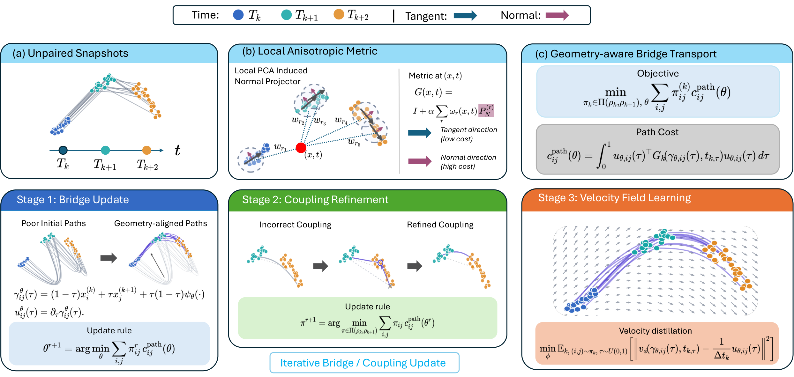

# PACE

[](https://arxiv.org/abs/2605.18587)

PACE is a two-stage flow-matching pipeline for time-resolved single-cell
trajectory inference.  This directory is a self-contained distribution that
ships PACE and the embryoid-body PHATE dataset (`data/eb_velocity_v5.npz`).
The corresponding preprint is available on arXiv:
[arXiv:2605.18587](https://arxiv.org/abs/2605.18587).

This repository is an active public-release snapshot. The current version
contains the core PACE implementation, Hydra configurations, EB PHATE example
data, training scripts, and evaluation utilities. The README and release
assets will be expanded alongside the paper release with the complete paper
datasets, preprocessing details, baseline implementations or adapters, and the
corresponding reproduced baseline results.



## Current status

The code in this repository is sufficient to run the included EB PHATE example
end-to-end and inspect the produced trajectory, distribution, and velocity
metrics. Some publication-facing materials are still being organized and will
be added in future updates:

- complete datasets and download/preprocessing instructions used in the paper
- baseline methods, wrappers, and configuration files used for comparison
- reproduced baseline metrics and plotting scripts for paper tables/figures
- additional experiment documentation for reproducing all reported results

## Layout

```
PACE/
├── train.py                    # Hydra entry point
├── requirements.txt            # pip freeze of conda env `sc`
├── assert/                     # paper figures
│   ├── fig1.pdf
│   └── fig1.png
├── configs_hydra/              # Hydra configs
│   ├── data/eb_phate.yaml
│   ├── method/pace.yaml
│   ├── model/stage1/pace_{hungarian,sinkhorn,emd,uot}.yaml
│   ├── model/stage2/ode.yaml
│   └── experiment/eb_phate_pace_ode.yaml
├── data/eb_velocity_v5.npz     # EB PHATE dataset
├── src/
│   ├── methods/pace/           # PACE training pipeline
│   │   └── stage2/             # vendored Stage 2 helpers used by PACE
│   ├── dataloaders/eb_data.py
│   └── plot/                   # stage1/stage2 visualizations
├── scripts/
│   ├── run_eb_phate.sh                      # run PACE end-to-end
│   └── eval_holdout_velocity_metrics.py     # holdout velocity metrics
└── notebooks/eb_phate_pace_test_results.ipynb
```

## Install

```bash
# inside an isolated Python 3.10+ environment
pip install -r requirements.txt
```

`requirements.txt` is a full `pip freeze` of the conda env `sc` used during
development.  Core dependencies:

- `torch`, `pytorch-lightning`, `torchdyn`
- `hydra-core`, `omegaconf`
- `numpy`, `scipy`, `scikit-learn`, `pandas`, `matplotlib`
- `POT` (Python Optimal Transport), `scanpy`, `anndata`

## Run

PACE on EB PHATE (default: 2-D PHATE, 5 timepoints, holdout `[3]`):

```bash
cd PACE
python train.py experiment=eb_phate_pace_ode
# or:
bash scripts/run_eb_phate.sh
```

CPU debug run:

```bash
python train.py experiment=eb_phate_pace_ode \
    trainer=cpu \
    epochs=2 total_epochs_stage1=2 \
    samples_per_timepoint=64 \
    enable_progress_bar=false
```

## Outputs

Artefacts land under `results/<data_name>_dim<D>_test<labels>/<method>/`:

- `metrics/distribution_metrics.csv` — MMD / W1 / W2 / GW per stage and
  predictor (`stage1_*`, `stage2/ode_rollout`, …)
- `plots/stage1/{interpolation_paths,midpoint_comparison,psi_magnitude,trajectory_overview}.png`
  (2-D data only)
- `plots/stage2/*.png` — ODE-rollout trajectories vs ground truth
- `checkpoints/stage1_psi/` and `checkpoints/stage2_flow/`

By default, Stage 2 uses exact mini-batch OT pairing via the local
`src.methods.pace.stage2.matching` helper. To reuse the final Stage 1 matchings
instead, run with `use_stage1_matching=true optimal_transport_method=None`.

For the default `eb_phate` config the output dir is
`results/eb_phate_dim2_test3/pace/`.

## Holdout velocity evaluation

After training:

```bash
python scripts/eval_holdout_velocity_metrics.py results/eb_phate_dim2_test3
```

Compares the learned velocity field at each test cell's true position against
the reference `delta_embedding` velocity from the EB dataset and writes
`results/eb_phate_dim2_test3/holdout_velocity_metrics.csv` plus
`results/eb_phate_dim2_test3/pace/metrics/velocity_metrics.csv`.

## Result summary notebook

`notebooks/eb_phate_pace_test_results.ipynb` collects PACE's
`distribution_metrics.csv` and `velocity_metrics.csv` under
`eb_phate_dim2_test3` and renders the saved PNGs inline.

## Stage 1 backend reference

PACE Stage 1 supports four matching backends:

| Stage 1 config             | Matching method            |
|----------------------------|----------------------------|
| `pace_hungarian` (default) | exact assignment           |
| `pace_sinkhorn`            | entropic OT                |
| `pace_emd`                 | exact OT (network simplex) |
| `pace_uot`                 | unbalanced OT              |

Override at the command line:

```bash
python train.py experiment=eb_phate_pace_ode model/stage1=pace_hungarian
```

## Data

`data/eb_velocity_v5.npz` provides:

- `pcs`            : `(16819, 100)` — PCA components
- `phate`          : `(16819, 2)`   — 2-D PHATE embedding
- `delta_embedding`: per-cell PHATE-space velocities
- `sample_labels`  : 5 timepoints `[0, 1, 2, 3, 4]`

`dim=2` selects PHATE; `dim>2` selects the leading PCA components.

## License

This project is released under the MIT License. See [LICENSE](LICENSE) for
details.
